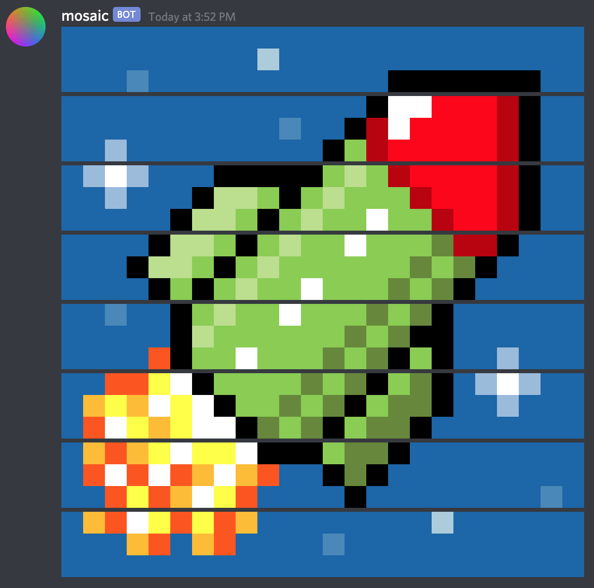
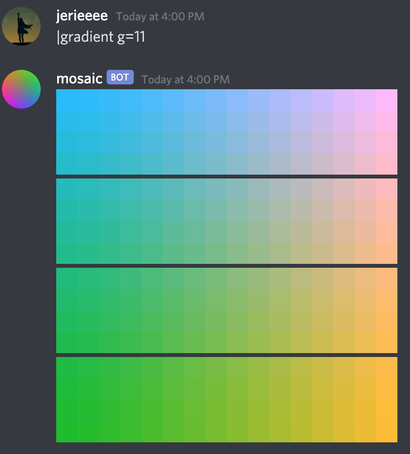

# Status of this repository
This repository contains the source code of the Discord bot Mosaic (`mosaic#1013`, bot user ID `771643297088667648`).

This project is currently a work in progress. As such, there is no public way for anyone to try the bot out. If you would like to join the alpha test server, please contact me. The beta phase will begin soon. 

The source code is provided for educational purpose only. In each release, instructions will be provided on how to run the bot locally. While the instructions aim to be functional, no support will be provided in setting up your own instance of the bot. However, you may not deploy any Discord bot that utilizes any portion of this project's source code to more than 3 servers. 

# Mosaic Bot

Getting tired of wanting to demonstrate power but only being able to send small images on Discord, 
like this?  

Well, this is why the mosaic bot is here! If the image you wanted to send happened to be a pixel art,


And, you can make it **even larger**! Like this:


But why stop at the fireball when you can fly


above and beyond to the 100m


where things can be colorful


To give a more direct comparison of the size differences: 

```
