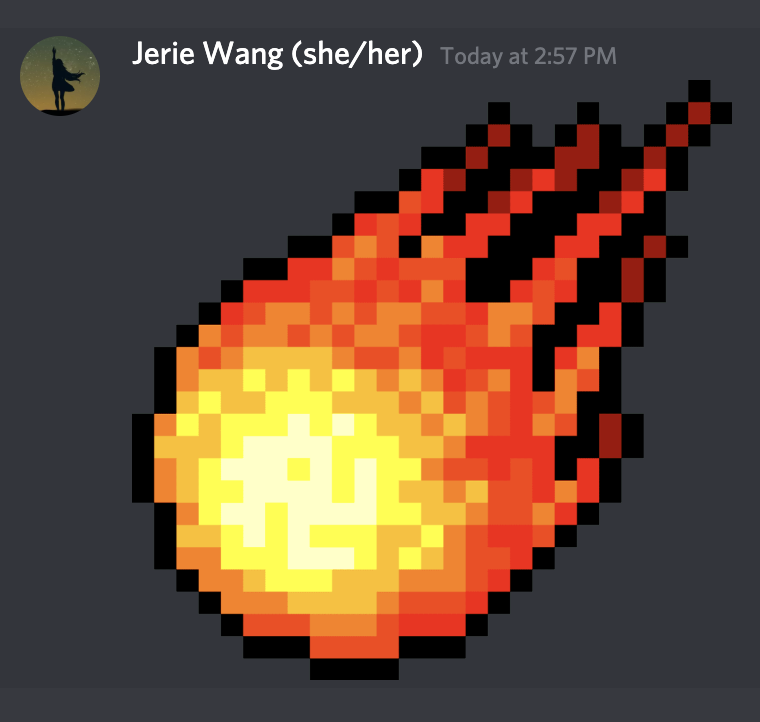
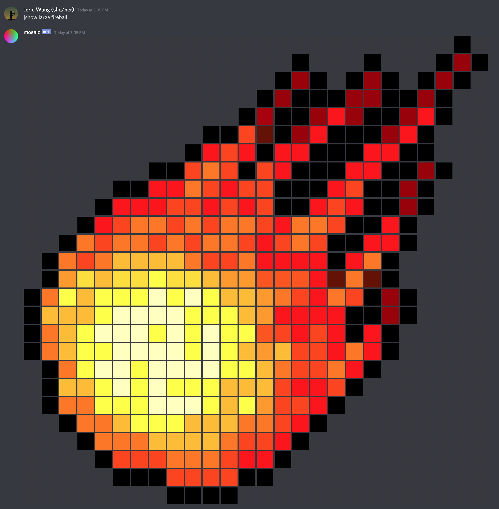
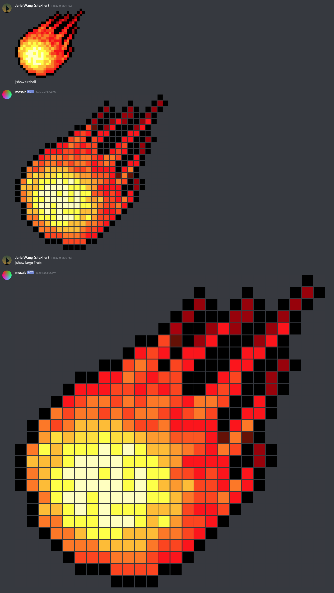
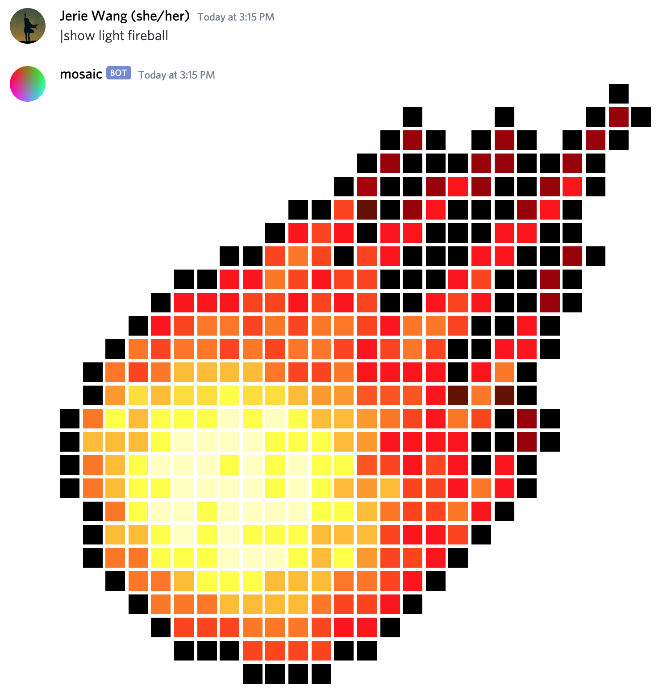
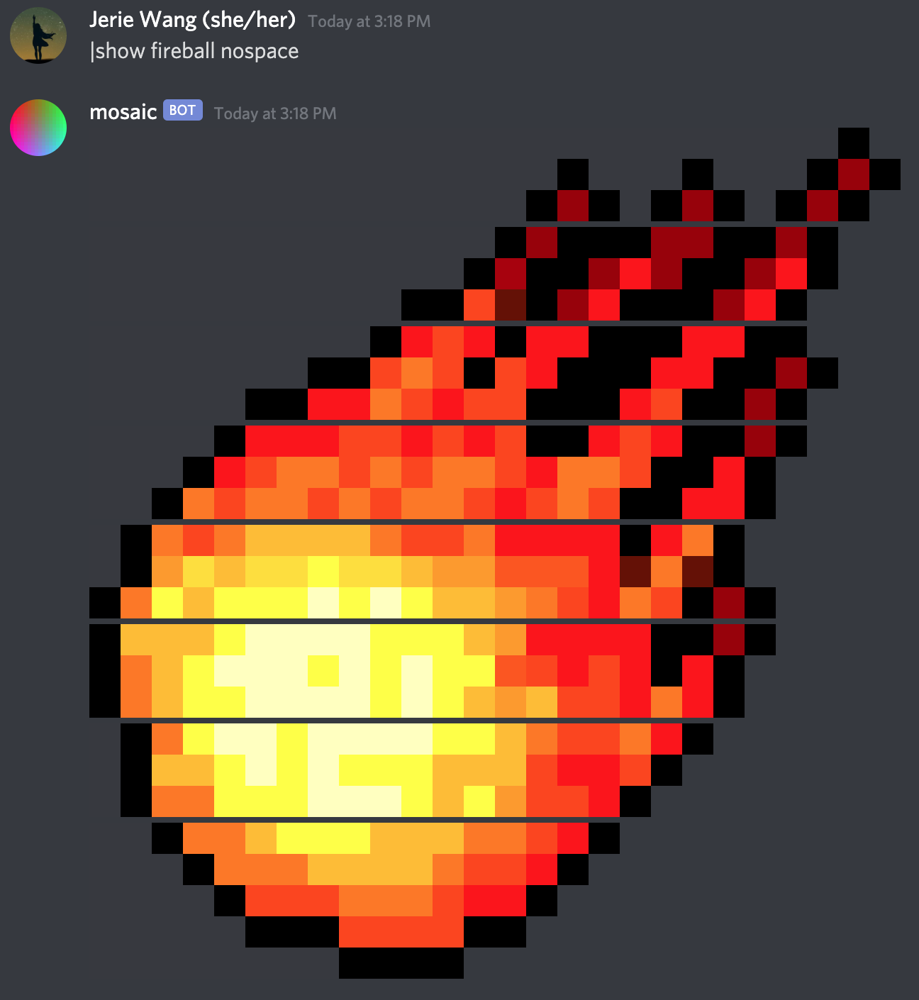
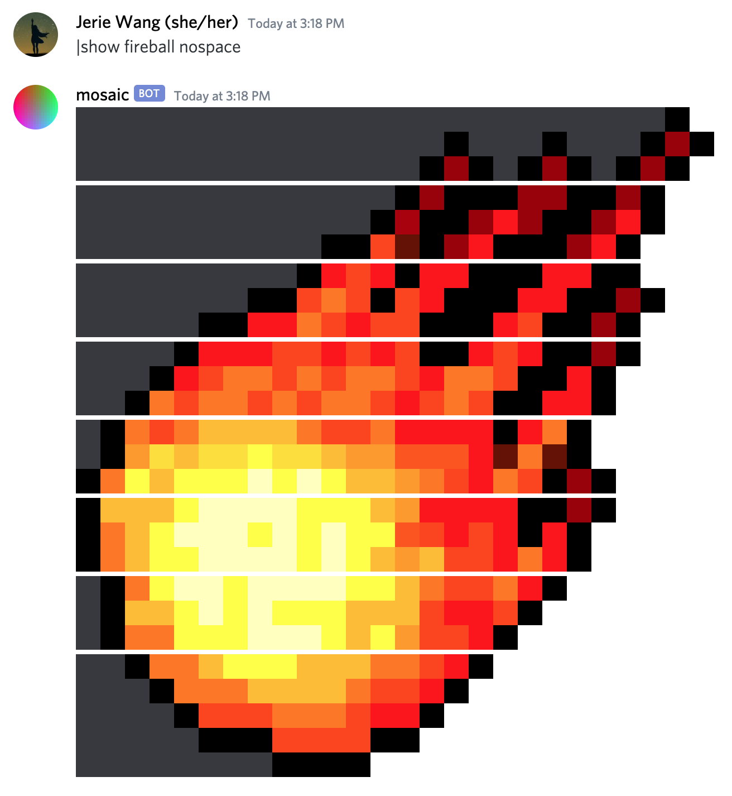
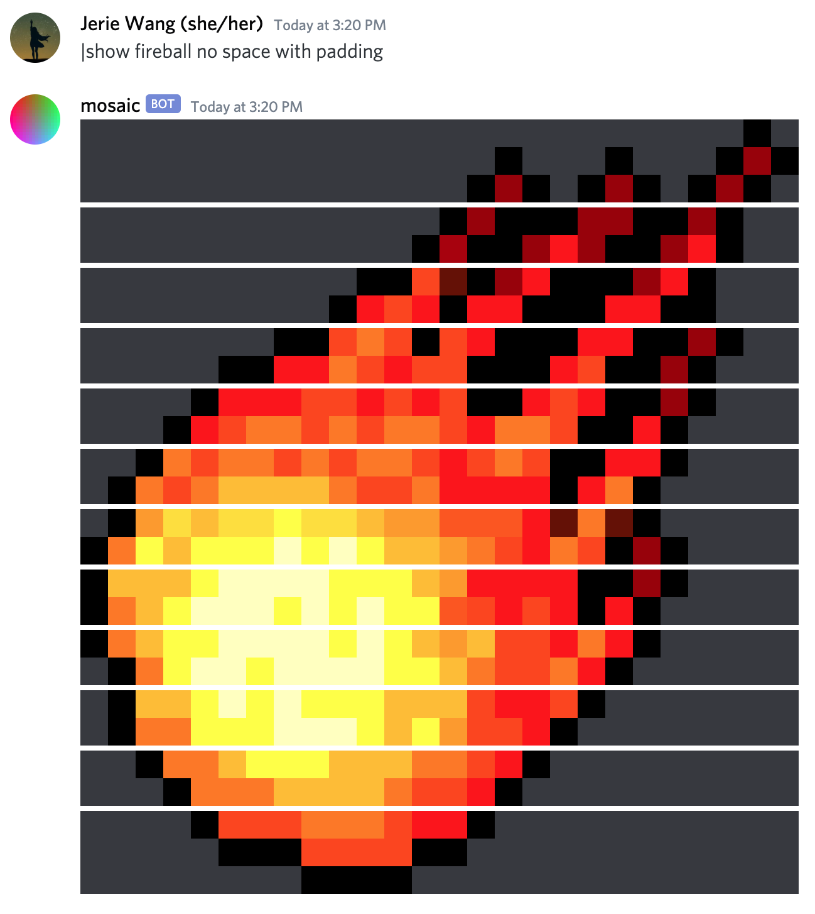

# Mosaic Bot

Getting tired of wanting to demonstrate power but only being able to send small images on Discord, 
like this?  

Well, this is why the mosaic bot is here! If the image you wanted to send happened to be a pixel art,


And, you can make it **even larger**! Like this:


although...your friends might need a 4k monitor to render it correctly. You've been warned.

To give a more direct comparison of the size differences: 


If you happen to love light mode just like all your friends, you are covered!


Don't like spacing? Don't worry, the bot can try it's best to remove all the 
spaces:


Of course, if the image in interest is larger than 8x8, multiple messages
are still necessary due to Discord's 2000 characters limit. 

But what if some of your friends love light mode, some despise it? An image
looking like this is...a little bit weird


In that case, you can instruct the bot to pad the image to a rectangle even in
the less space mode: 


Admittedly, it still looks a little bit weird, but way less so.

## Command Reference

```
|show help
```
Display a link to the [help page](https://mosaic.by.jerie.wang/references).

```
|show $image_name 
```
Shows the name specified by `$image_name`. The following modifiers exist:

- large: show an larger version of the image. Only applicable to images that are less than 28 pixels wide.
- no space, nospace: removes the spaces between horizontal pixels and attempt to lump as many pixels together as possible
- with padding: pads the image to a rectangle, only has effect if `no space` is specified and `large` is not specified
- light: set the background to white

The modifiers can exist in any location of the command. The first unrecognized token will be treated as the image name.
After that, all unrecognized tokens are ignored. So, 
```
|show large light fireball
``` 
is functionally equivalent to 
```
|show fireball that is large, embraced by the lord of light, and with no space in between
```
