# Auto scaling

The bot has the feature of accepting new image uploads, and any pixel art is 
fine by the bot. However, a lot of the times, when you look at an image of a
pixel art, it is usually not at its "true size" -- that is, one "pixel" on the 
image isn't really a pixel on your screen (otherwise it would be really tiny 
for anyone on a remotely modern display to see it). This means that for 
[almost all](https://en.wikipedia.org/wiki/Almost_all) the new uploads, the 
source image has to be scaled down to it's true pixel size. Cool. 

## Why is it hard?

The auto scaling might seem to be the simplest part of the bot. After all, you 
just have to scale the image down by a bit and...wait, scale it down by how much?

This might be an obvious question for humans, but certainly not for a program.
And sometimes it's not even that obvious for humans. For example, take a look 
at this image of a cherry, which has a dimension of 1036x1036 px:

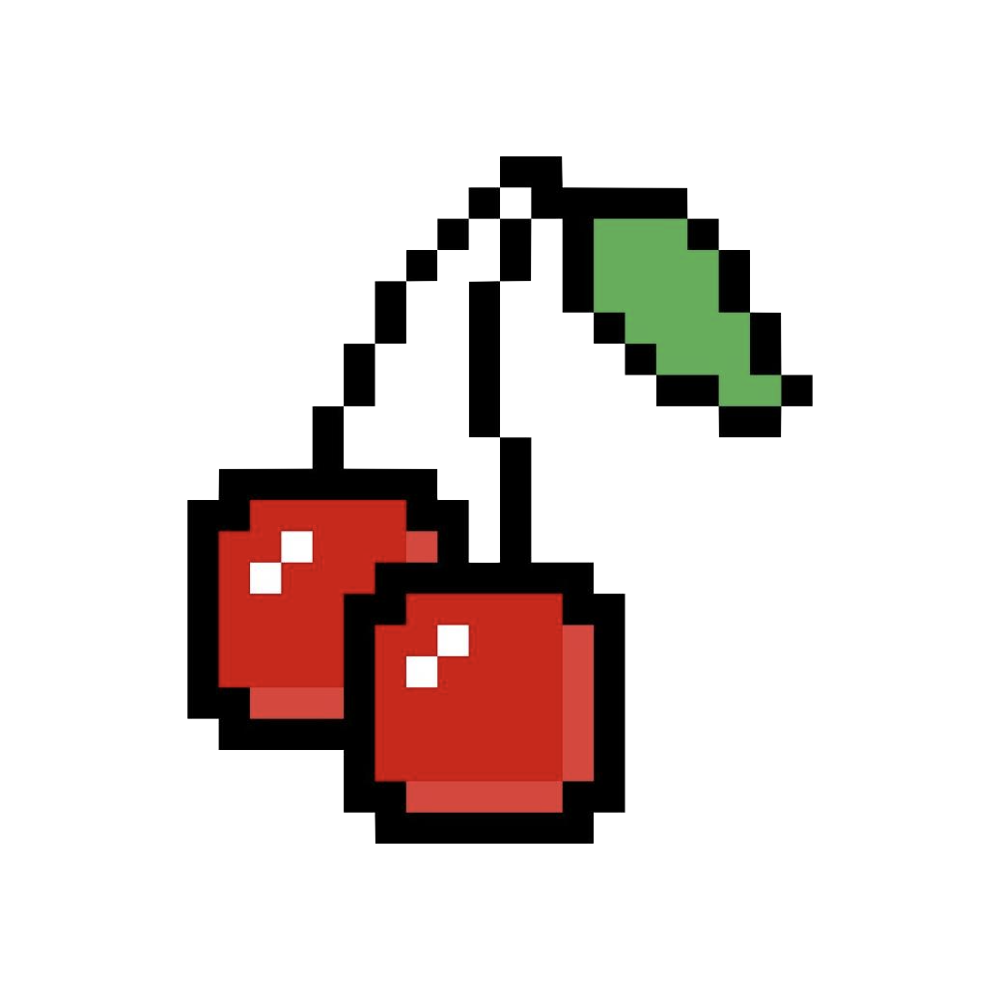

Looks fine right? Let's add some checker background for the transparent part
of the image:

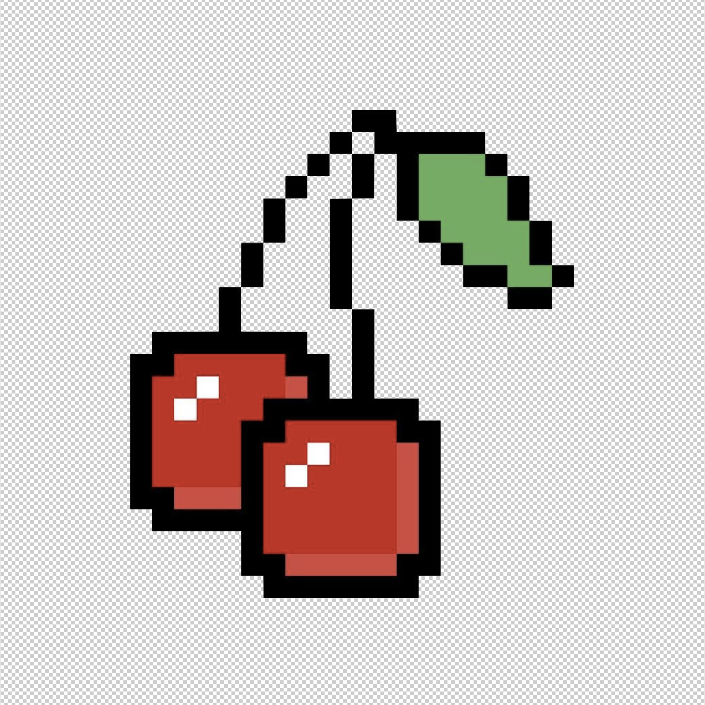

Intuitively, the transparent border around the actual cherry will create a
problem for the program. But it's actually the least important part. If we 
zoom in on the cherry a little bit:

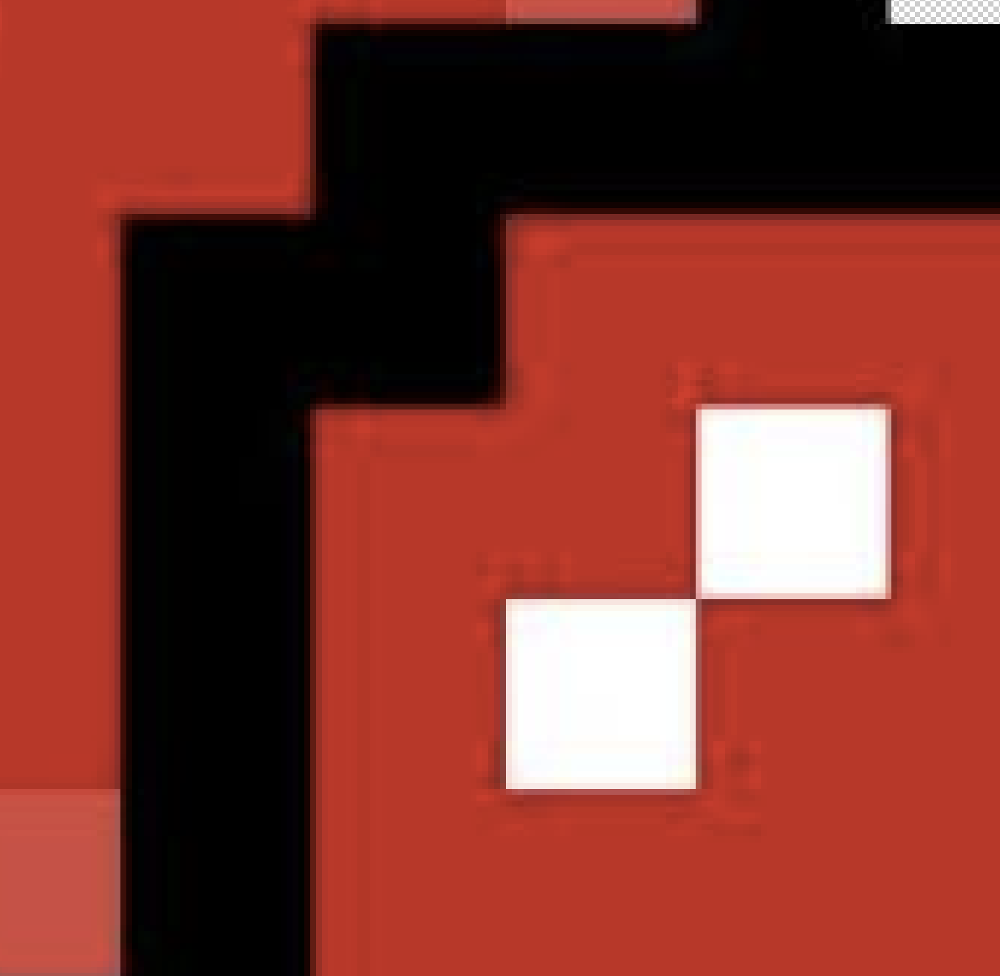

It is now obvious that the image is of really low quality due to compressions,
and it might be hurting your eyes a little bit. More importantly, can you really
tell where the boundary for each pixel is?

Well good news: even if you can't, the mosaic bot can. 

## The simple algorithm

First, the image is cropped to its bounding box, which now has a dimension of
648x713 px (yikes, odd number).

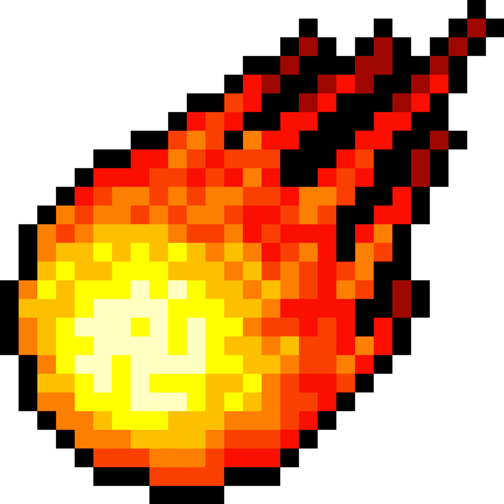

Then, an edge detection is carried out using the 
[canny edge algorithm](https://en.wikipedia.org/wiki/Canny_edge_detector).

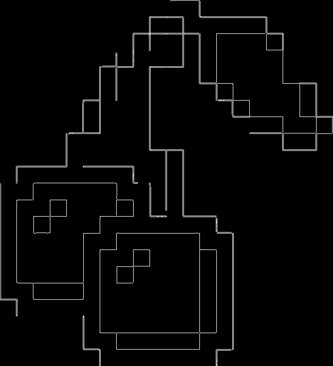

After that, contours are detected around the edges (different colors represent
different segments of the contour)

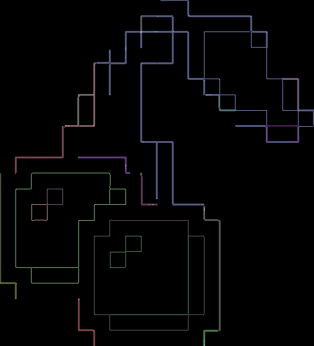

Bounding boxes are fitted to each contour (contour and edges are hidden for
visual clarity, but each bounding box is drawn using the same color as the corresponding 
contour)

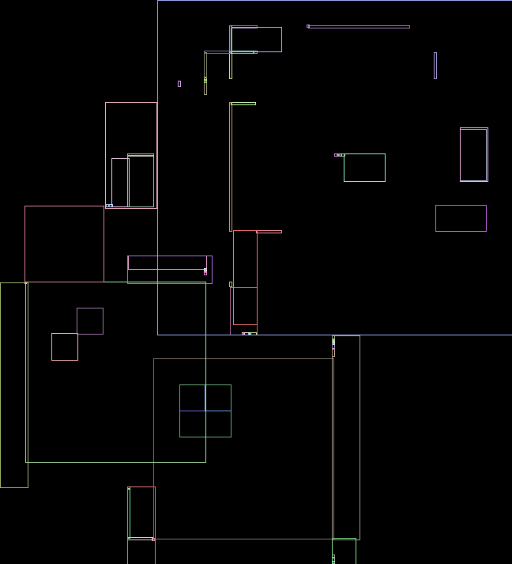 

The width and heights of each bounding box is calculated and recorded, 
with all bounding boxes of area less than 4 pixels ignored because they are just noise.  
Here's a list of the most frequent 10 sizes (we call them sizes because we know
we are dealing with square pixels):

```
Size: 3,   Occurrence: 32
Size: 33,  Occurrence: 21
Size: 4,   Occurrence: 7
Size: 228, Occurrence: 6
Size: 35,  Occurrence: 5
Size: 65,  Occurrence: 4
Size: 5,   Occurrence: 4
Size: 32,  Occurrence: 3
Size: 7,   Occurrence: 3
Size: 34,  Occurrence: 3
```

Well, some numbers are clearly unrealistic given the resolution of the source
image. For example, 228px per "pixel" is clearly too large, as it would put 
the entire image to be made of 9 pixels total. And 3px per "pixel" is obviously
too small given that we can handle, at maximum, an image of 79 pixels wide. So,
after filtering out both extremes, we are left with

```
Size: 33,  Occurrence: 21
Size: 35,  Occurrence: 5
Size: 65,  Occurrence: 4
Size: 32,  Occurrence: 3
Size: 34,  Occurrence: 3
```

which looks much more realistic. Since we know that in many cases, the edges of
the "pixels" are diffused by 1 or 2 px, we take both into account. So we now 
have

```
Size: 30,  Occurrence: 3
Size: 31,  Occurrence: 21
Size: 31,  Occurrence: 3
Size: 32,  Occurrence: 21
Size: 32,  Occurrence: 3
Size: 32,  Occurrence: 3
Size: 33,  Occurrence: 21
Size: 33,  Occurrence: 5
Size: 33,  Occurrence: 3
Size: 34,  Occurrence: 5
Size: 34,  Occurrence: 3
Size: 35,  Occurrence: 5
Size: 63,  Occurrence: 4
Size: 64,  Occurrence: 4
Size: 65,  Occurrence: 4
``` 

Ah, there are a lot of repeating sizes. We should probably merge them. 

```
Size: 30,  Occurrence: 3
Size: 31,  Occurrence: 24
Size: 32,  Occurrence: 27
Size: 33,  Occurrence: 29
Size: 34,  Occurrence: 8
Size: 35,  Occurrence: 5
Size: 63,  Occurrence: 4
Size: 64,  Occurrence: 4
Size: 65,  Occurrence: 4
```

Well, now it's not really occurrence anymore, let's call the number the score 
instead, and we'll replace "size" by "scale", since it's what we are really
looking for. 

For each possible scale, we check if there is another scale that is the integer
multiple of this scale, since we are dealing with pixel arts and the bounding
boxes might be picking up something that is a cluster of "pixels". If so, we 
add 1 to the score of the smaller scale. Also, since we know that the artists 
are humans, they are more likely to choose reasonable numbers, such as multiples
of 5 or powers of 2 as their scale, those numbers get a small boost too. After 
that, we get

```
Scale: 32,  Score: 34
Scale: 33,  Score: 30
Scale: 31,  Score: 26
Scale: 35,  Score: 11
Scale: 64,  Score: 10
Scale: 65,  Score: 10
Scale: 30,  Score: 9
Scale: 34,  Score: 9
Scale: 63,  Score: 5
```

Ok cool. The algorithm figured out the correct scale. Ladies, gentlemen, and
our beloved enbies, thanks for...oh wait, I might have forgotten something. 
What is the correct scale again?

## The correct scale

To answer this question, we have to first define how we are resizing images,
which, isn't as obvious as it seems because there are more than one way of 
doing it. Many common resizing algorithms can be visually summarized by
this chart (don't worry about the two "none" algorithms, they are something
specific to matplotlib)


Since we know we are dealing with pixel arts, clearly we should choose the 
nearest algorithm (a.k.a. [nearest neighbour interpolation](https://en.wikipedia.org/wiki/Nearest-neighbor_interpolation)),
which isn't always the default algorithm when you are scaling images in various
image editing programs. Usually, they use bicubic or bilinear.
Fun fact, there are some [really cool algorithms](https://en.wikipedia.org/wiki/Pixel-art_scaling_algorithms#/media/File:Pixel-Art_Scaling_Comparison.png)
for scaling pixel arts up. But since we are scaling them down, these are of 
little relevance.  

Now that we defined how we are scaling images, we can finally talk about what 
the correct scale means. It's actually easier to show what will happen if an 
incorrect scale is chosen. Here is an image of [niko](https://oneshot.fandom.com/wiki/Niko),
downsampled by a factor of 10 from the source.

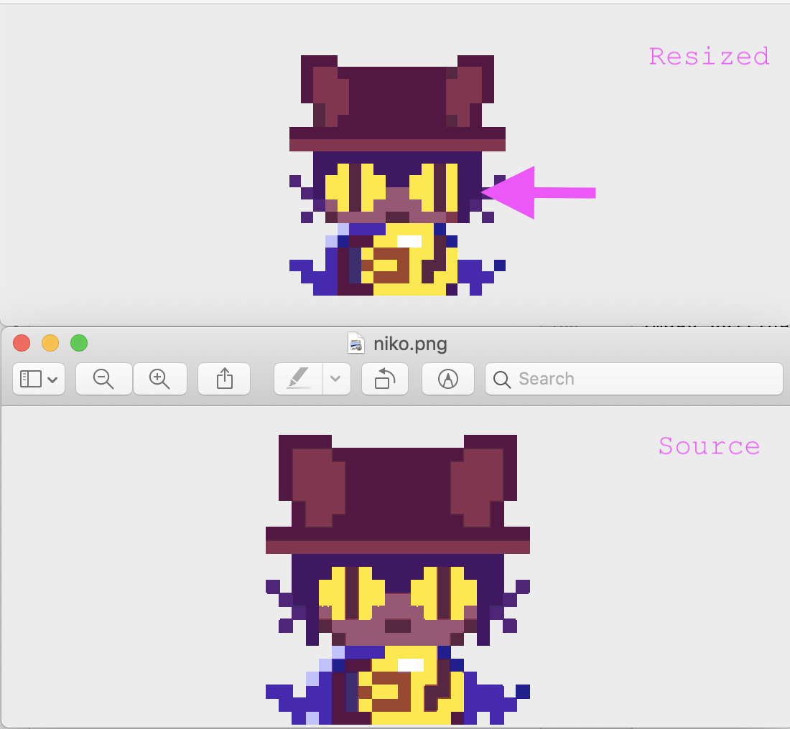


It just looks obviously wrong, right? Well...not always. Take a look at this
fireball, downsampled by a factor of 40. Does it look correct to you? 

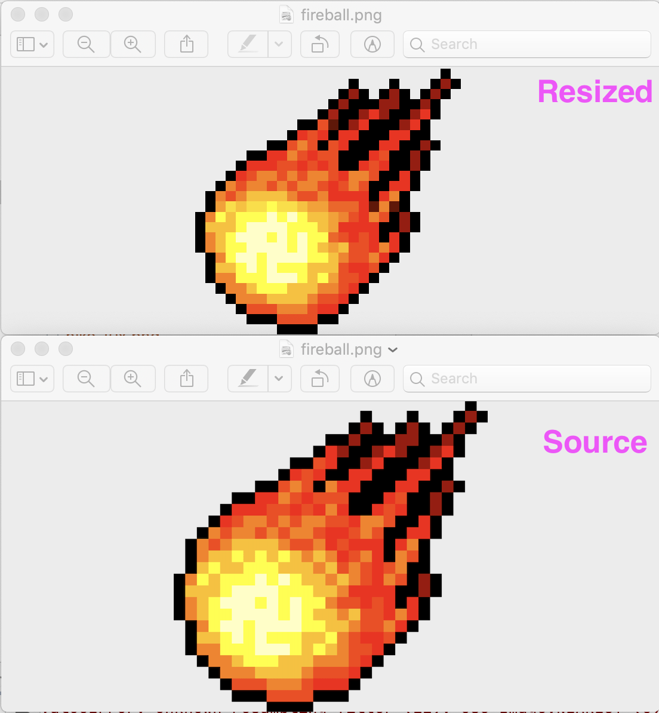


If your answer is yes, then congratulations, that's what I (and by association,
the mosaic bot) thought for a long time. But unfortunately, it's not correct. 
Let's take a closer look

 

There are actually a few more differences. You might wonder, who can notice these 
little difference? Well there's an obvious answer: the mosaic bot.

## The alignment check

Let's try this again. This time, we'll use the fireball as the source image.
Repeating the steps above:

First, canny edge:

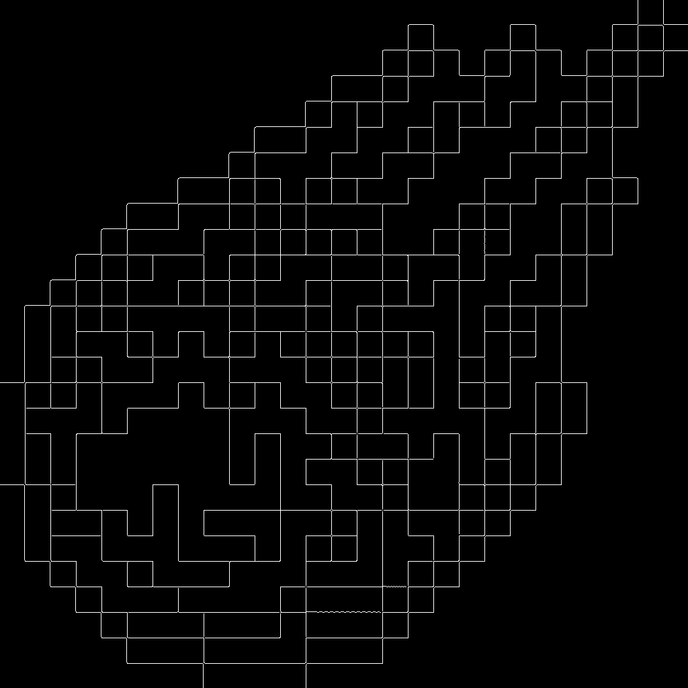

Then, contour detection:

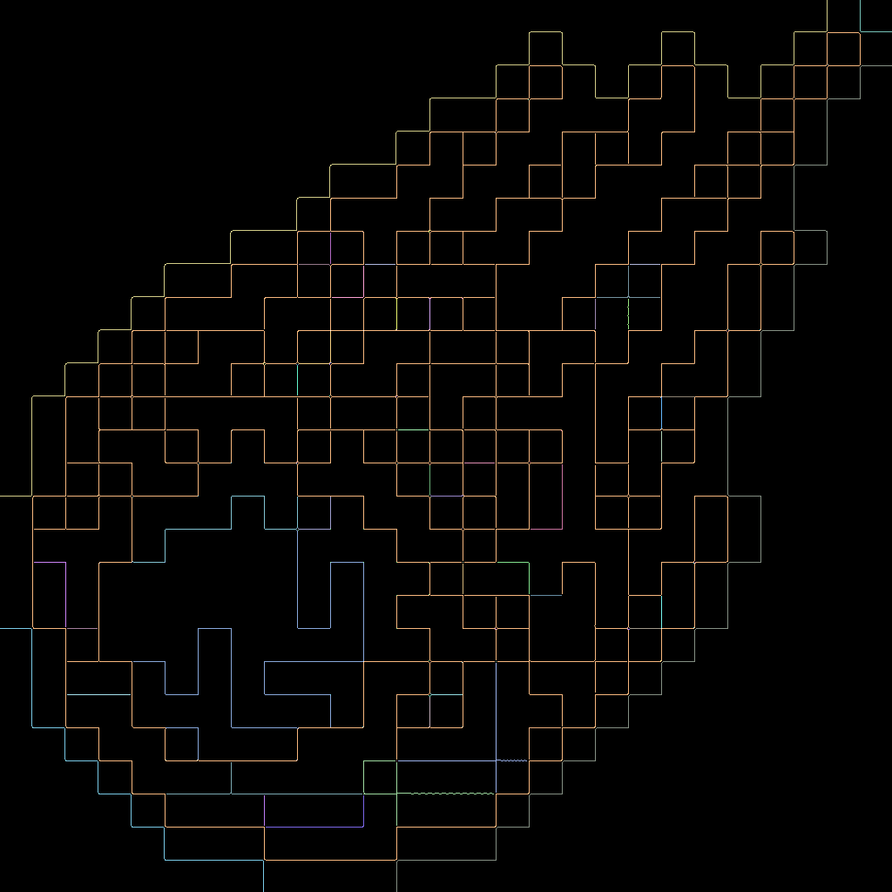

Compute the bounding boxes:

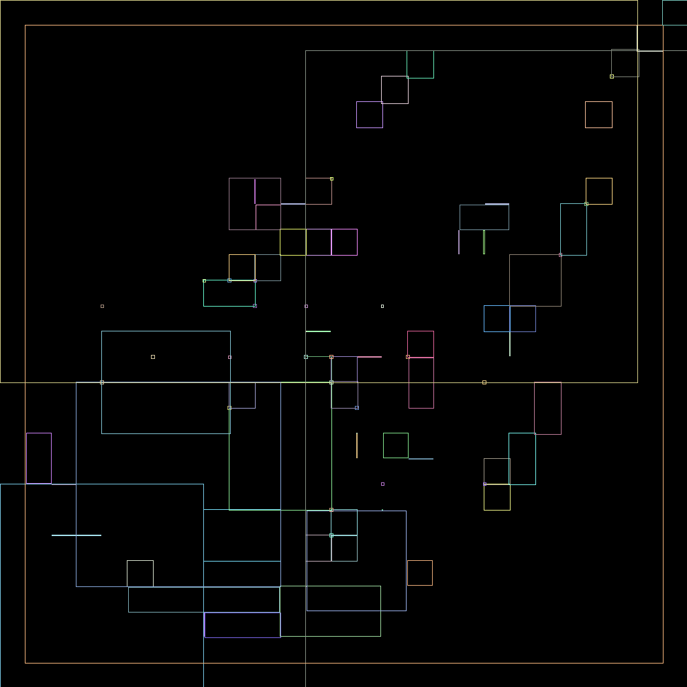

Compute the score for each scale:
```
Scale: 39,  Score: 57
Scale: 38,  Score: 55
Scale: 37,  Score: 46
Scale: 40,  Score: 17
...
```

And now we have a few options, and 39 and 38 seems to be almost equally 
possible, with a slightly less possible scale of 37 (ugh, prime, what kind of
artist would use this).

So...let's try resizing all of them and see which one looks better? We can downsample
the source image according to each possible scale, and then compute the difference
from the source. Here's a visualization of this process, where brighter area
indicates a higher difference.   

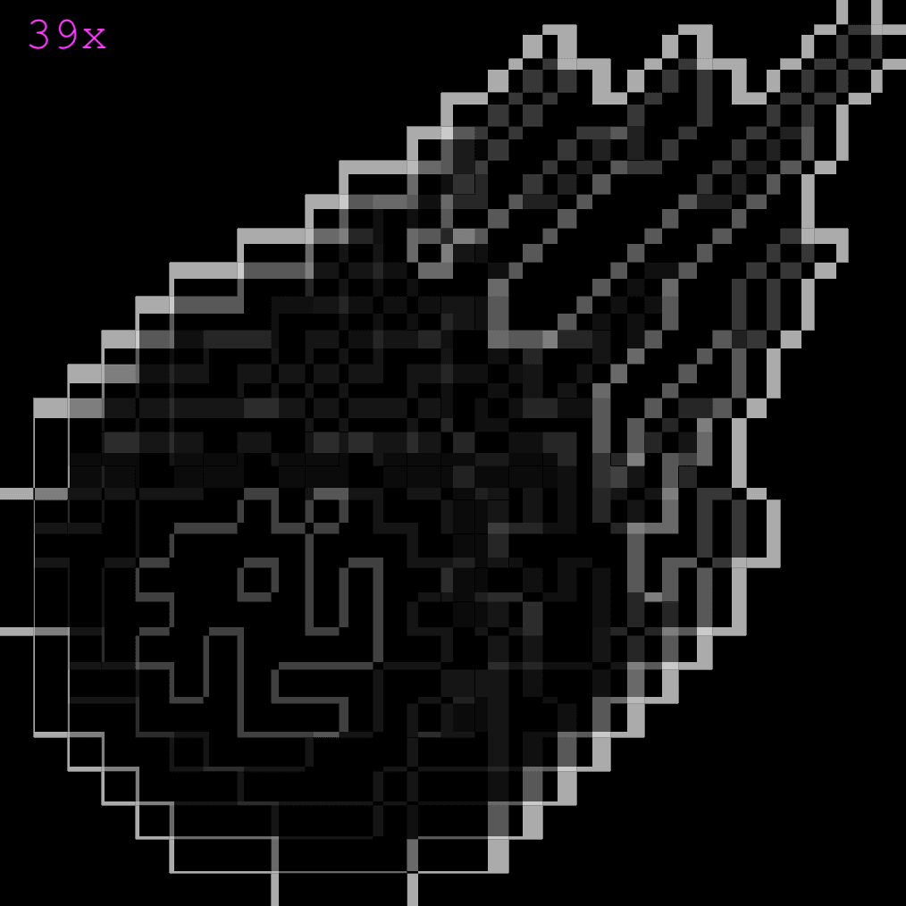
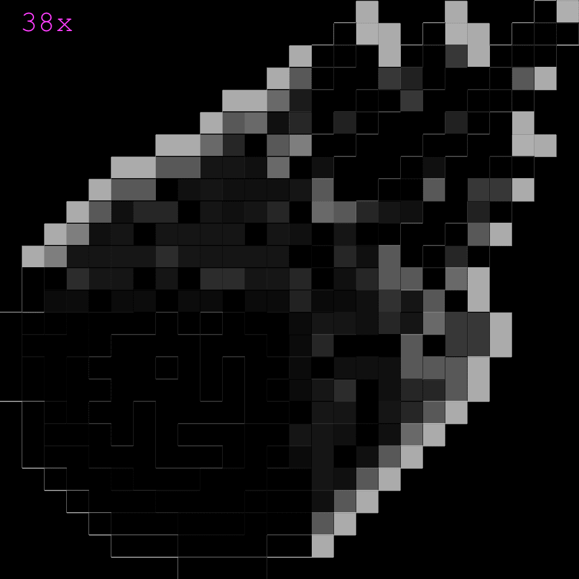
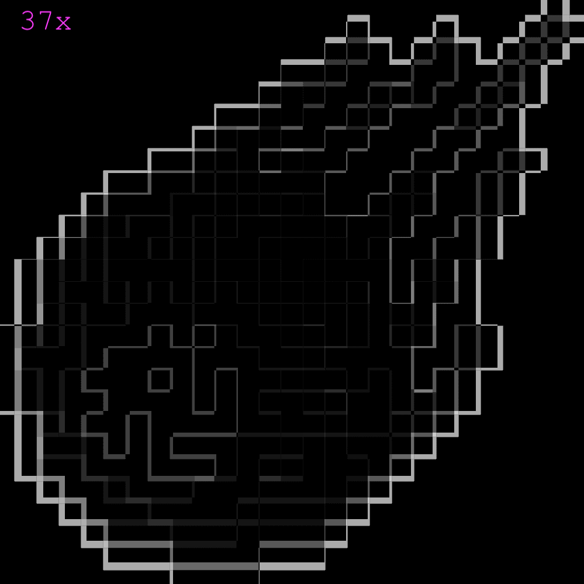
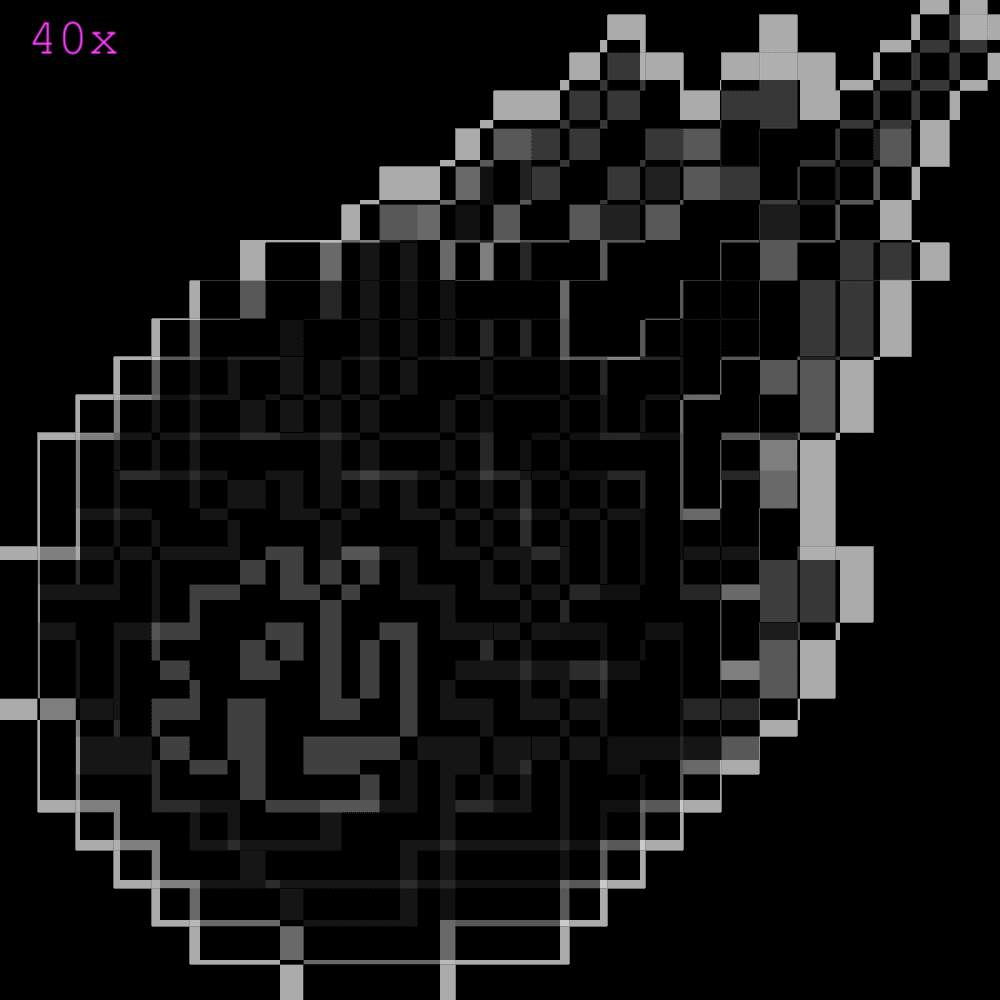

Clearly, 37 is the best scale in this case because it produces the lowest amount
of difference from the source image. More importantly, only the edges of the 
pixels are different, which means they are actually the same pixel. For other 
scales, the center of some pixels are different, which indicates that they 
are just different. Therefore, 37 is the best scale for this image, and the 
mosaic bot agrees. 

```
Scale: 37,  Score: 309.06 Alignment: 92.3%
Scale: 39,  Score: 306.59 Alignment: 87.58%
Scale: 38,  Score: 299.52 Alignment: 85.8%
Scale: 40,  Score: 263.76 Alignment: 86.58%
...
```

And now if you see the annotated image on the website, you know what all those
weird lines mean (blue lines for contours, green lines for bounding boxes,
and magenta shades for the difference between the scaled image and the source
image) 

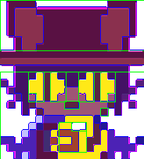
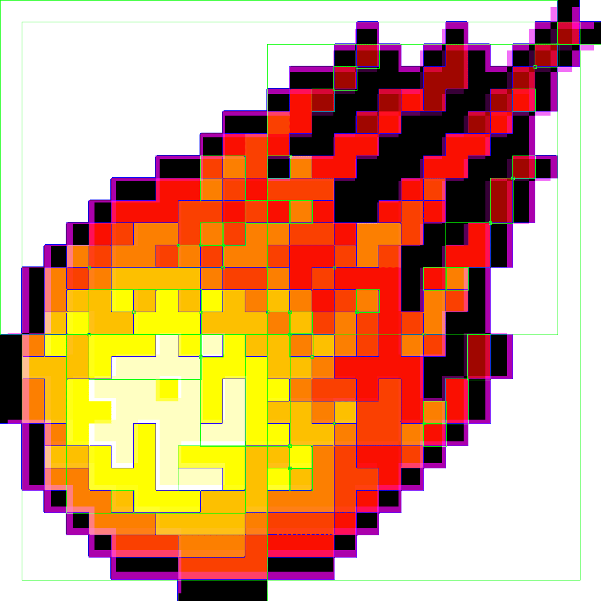

By the way, if you wonder where the algorithm described in this document came
from: I made it.
